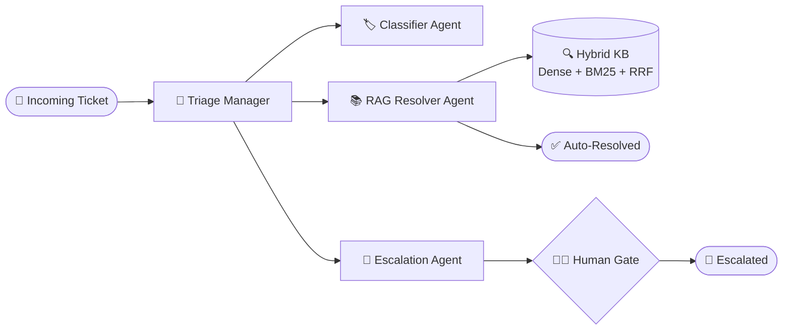
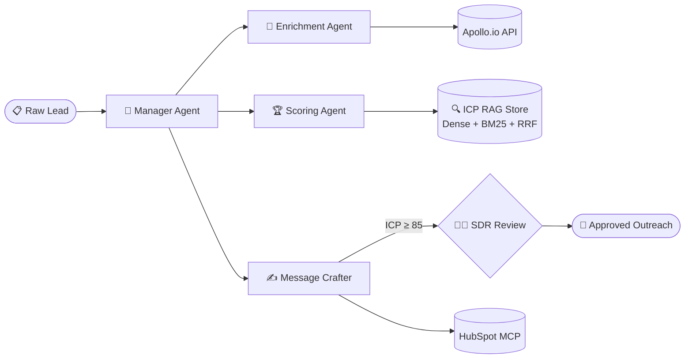
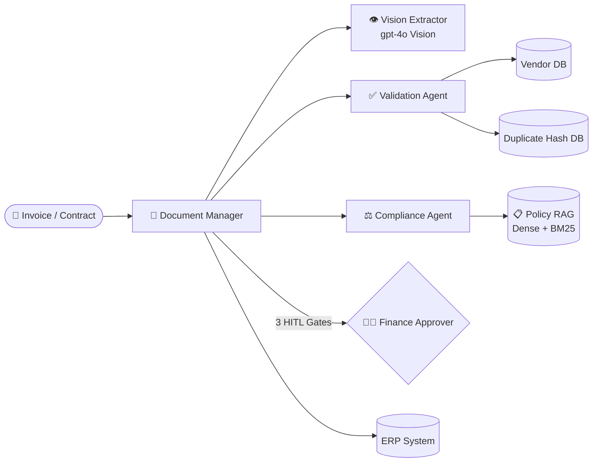

# 🏗️ Agentic AI Architecture Blueprints
**Enterprise-Grade Multi-Agent System Design Portfolio**

> Production architecture blueprints demonstrating real-world applications of
> Oracle Agentic AI Foundations principles: Multi-Agent Topologies, ReAct Loops,
> Hybrid RAG, Model Context Protocol (MCP), and Human-in-the-Loop (HITL) Governance.
>
> **Author:** Yevhen Shaforostov | Oracle Certified Agentic AI Foundations Associate (1Z0-1157-26, 2026)

---

## 📋 Blueprint Index

| # | Blueprint | Industry | Agent Pattern | Key Concepts | Estimated Cost |
|---|-----------|----------|---------------|--------------|----------------|
| 1 | [**Support Triage Agent**](./SAMPLE_BLUEPRINT_SUPPORT_TRIAGE.md) | Customer Success | Hierarchical Manager-Worker + Handoffs | ReAct Loop, Hybrid RAG, MCP (stdio), HITL (2 gates) | ~$0.025/ticket |
| 2 | [**Lead Qualification Agent**](./SAMPLE_BLUEPRINT_LEAD_QUALIFICATION.md) | Sales & RevOps | Sequential Pipeline + Manager Coordination | ICP Scoring RAG, LCEL, MCP (SSE), HITL (1 gate) | ~$0.022/lead |
| 3 | [**Document Intelligence Agent**](./SAMPLE_BLUEPRINT_DOCUMENT_INTELLIGENCE.md) | Finance & Legal | Sequential Pipeline + Parallel Validation | GPT-4o Vision, Policy RAG, HITL (5 gates), Duplicate Detection | ~$0.048/doc |

---

## 🧩 What Each Blueprint Contains

Every Blueprint is a **Tier B Architecture Blueprint deliverable** — the exact output
a client receives from the *Agentic AI Architecture Blueprint* engagement ($1,250, 5 days).

Each document includes:

```
✅ Executive Summary Table          — key parameters at a glance
✅ System Architecture Flowchart    — Mermaid diagram (full agent topology)
✅ ReAct Sequence Diagram           — step-by-step agent loop walkthrough
✅ Framework Selection ADR          — documented decision with alternatives compared
✅ Tool Definition Schemas (JSON)   — production-ready JSON Schema for every tool
✅ HITL Policy Table                — approval gates, thresholds, timeouts, escalation
✅ RAG & Memory Strategy            — vector DB config, chunking, hybrid search setup
✅ Token Economics Estimate         — cost per operation vs manual baseline
✅ 3-Week Implementation Roadmap    — sprint-by-sprint execution plan
```

---

## 🔷 Blueprint 1: Support Triage Multi-Agent System

**File:** [SAMPLE_BLUEPRINT_SUPPORT_TRIAGE.md](./SAMPLE_BLUEPRINT_SUPPORT_TRIAGE.md)

**Business Problem:**
Tier-1 support teams handling repetitive tickets at $6–$15/ticket manual cost.
85% of tickets fall into predictable categories with known resolutions.

**Agent Architecture:**



**Oracle Agentic AI Concepts Demonstrated:**
- `handoff_description` field for declarative routing (OpenAI Agents SDK, Module 4)
- ReAct Thought → Action → Observe loop (Module 1)
- Hybrid Vector Index: Dense + BM25 + RRF (Module 6)
- MCP stdio transport for Zendesk integration (Module 3)
- Input/Output Guardrails against prompt injection (Module 1)

**ROI:** $0.025/ticket vs $6–$15 manual → **240–600× cost reduction**

---

## 🔷 Blueprint 2: Lead Qualification Multi-Agent System

**File:** [SAMPLE_BLUEPRINT_LEAD_QUALIFICATION.md](./SAMPLE_BLUEPRINT_LEAD_QUALIFICATION.md)

**Business Problem:**
SDR teams spending 60–70% of time on manual lead research and scoring.
Qualification decisions are inconsistent and undocumented.

**Agent Architecture:**



**Oracle Agentic AI Concepts Demonstrated:**
- LCEL pipe operator for sequential pipeline (Module 2)
- MCP SSE transport for HubSpot integration (Module 3)
- Long-Term Memory: ICP Profile Store (Module 5)
- Self-Reflection loop in Message Crafter (Module 1 — Reflect/Observe)
- Hybrid RAG for semantic ICP matching (Module 6)

**ROI:** $0.022/lead vs $25–$80 SDR manual cost → **1,100–3,600× cost reduction**

---

## 🔷 Blueprint 3: Document Intelligence Multi-Agent System

**File:** [SAMPLE_BLUEPRINT_DOCUMENT_INTELLIGENCE.md](./SAMPLE_BLUEPRINT_DOCUMENT_INTELLIGENCE.md)

**Business Problem:**
Finance teams manually processing 200–500 invoices/month at $8–$25 each.
30% error rate on manual data entry. Approval bottlenecks delay vendor payments.

**Agent Architecture:**



**Oracle Agentic AI Concepts Demonstrated:**
- GPT-4o Vision as a tool within the agent loop (Module 4 — `@function_tool`)
- Parallel agent execution: Validation + Compliance run simultaneously (Module 1)
- 5-gate HITL policy with timeout escalation chains (Module 1 — Safety)
- On-premise pgvector for compliance-sensitive policy data (Module 6)
- Per-field confidence scoring as input guardrail (Module 4 — Guardrails)

**ROI:** $0.048/document vs $8–$25 manual → **170–520× cost reduction**

---

## 📊 Comparative Architecture Matrix

| Dimension | Support Triage | Lead Qualification | Document Intelligence |
|---|---|---|---|
| **Agent Pattern** | Hierarchical Manager-Worker | Sequential Pipeline | Sequential + Parallel Validation |
| **Primary Framework** | OpenAI Agents SDK | LangChain LCEL + OA SDK | LangChain LCEL |
| **MCP Transport** | stdio (Zendesk) | SSE (HubSpot) | stdio (S3) + SSE (Slack) |
| **Memory Type** | STM (session) + LTM (customer) | LTM (ICP profiles) + Scratchpad | LTM (vendor profiles) + STM |
| **RAG Strategy** | Hybrid: Dense + BM25 + RRF | Hybrid: Dense + BM25 + RRF | Policy RAG: Dense + BM25 |
| **HITL Gates** | 2 (escalation + refund) | 1 (high-value lead) | 5 (amount/compliance/confidence/vendor/duplicate) |
| **LLM Model** | gpt-4o-mini (primary) | gpt-4o-mini / gpt-4o | gpt-4o (Vision) + gpt-4o-mini |
| **Blended Cost** | ~$0.025/ticket | ~$0.022/lead | ~$0.048/document |
| **Manual Baseline** | $6–$15/ticket | $25–$80/lead | $8–$25/document |

---

## 🛍️ Productized Services

These blueprints are sample deliverables for the **Agentic AI Architecture Blueprint** service:

| Tier | Description | Price | Delivery |
|---|---|---|---|
| **Tier A — Foundation Blueprint** | Topology Decision, Framework ADR, Tool Schemas, Mermaid Diagram, RAG Strategy | **$750** | 3 days |
| **Tier B — Enterprise Blueprint** | All Tier A + MCP Integration Spec, HITL Policy, Guardrails Matrix, Token Economics, 1-hour Review Call | **$1,250** | 5 days |

📩 **Contact:** [Upwork Profile](https://www.upwork.com/freelancers/~014f724f47c12d0083) | [LinkedIn](https://www.linkedin.com/in/shaforostov) | [Djinni](https://djinni.co/q/6440c32c5f/)

---

## 📚 Related Resources

| Resource | Description |
|---|---|
| [ORACLE_AGENTIC_AI_FOUNDATIONS_MASTER_GUIDE.md](../ORACLE_AGENTIC_AI_FOUNDATIONS_MASTER_GUIDE.md) | Full 6-module curriculum + 40 certified exam Q&A |
| [AGENTIC_AI_SERVICES.md](./AGENTIC_AI_SERVICES.md) | Complete productized service tiers with pricing and scope |
| [UPWORK_LINKEDIN_PROFILES.md](./UPWORK_LINKEDIN_PROFILES.md) | Client-ready profile copy for Upwork, Djinni, LinkedIn |

---

*Oracle Certified Agentic AI Foundations Associate (1Z0-1157-26, 2026)*
*Candidate ID: OC8112637 | [Verify Certificate](https://catalog-education.oracle.com/ords/certview/sharebadge?id=7CD56C73FBEB10FA1DA49A7ABD0A0D74CB799DBFE3DEE980AF0D8F2403859E2D)*
