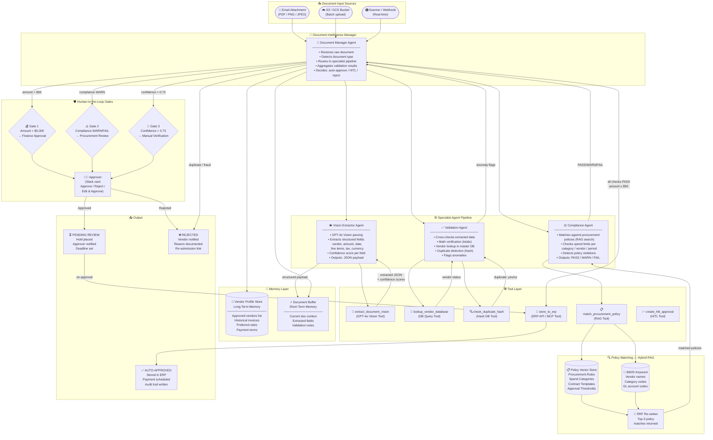
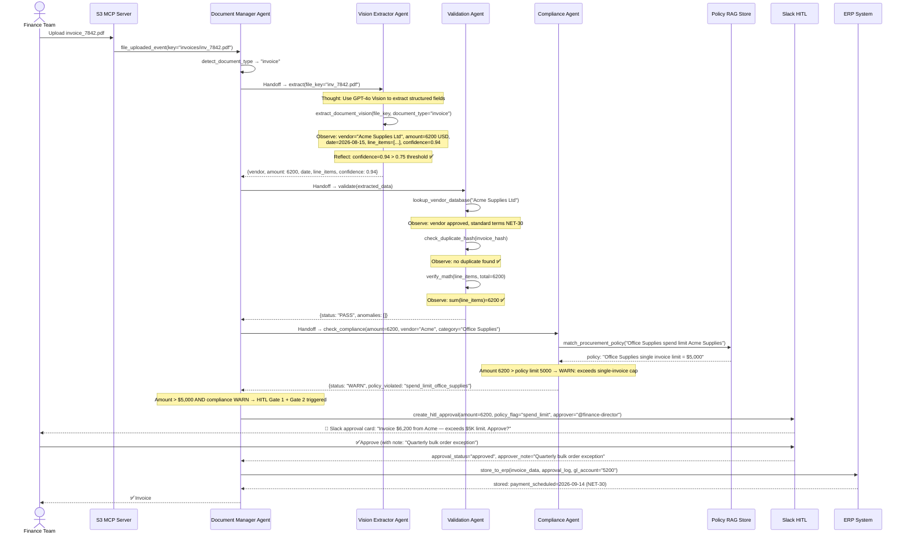

# 🏗️ Architecture Blueprint — Document Intelligence Multi-Agent System
**Sample Deliverable | Agentic AI Architecture Blueprint (Tier B)**
*Prepared by: Yevhen Shaforostov | Oracle Certified Agentic AI Foundations 2026*

> ⚠️ **Note:** Client name and domain-specific data have been redacted for portfolio use.
> Use case: automated invoice processing, contract extraction, and approval routing.

---

## 📋 Executive Summary

| Parameter | Value |
|---|---|
| **Use Case** | Automated Document Intelligence (Invoices / Contracts / Receipts) |
| **Agent Pattern** | Sequential Pipeline with Parallel Validation Agents |
| **Framework** | LangChain LCEL + OpenAI Agents SDK (Vision) |
| **LLM Model** | `gpt-4o` (Vision) for extraction + `gpt-4o-mini` for validation |
| **Memory** | Vendor Profile Store (Long-Term) + Document Context Buffer (Short-Term) |
| **RAG** | Policy Matching via Hybrid Search (Procurement Rules + Contract Templates) |
| **HITL Gates** | 3 gates: amount threshold / compliance flag / low confidence |
| **MCP Integration** | S3/GCS MCP Server (file access) + Slack MCP Server (notifications) |
| **Estimated Cost** | ~$0.08–$0.45 per document processed |
| **Expected ROI** | 85–90% reduction in manual document review time |

---

## 🗺️ System Architecture Diagram



---

## 🔄 Sequence Diagram — Invoice Processing (Vision + Validation + HITL)



---

## 📋 Framework & Model Selection — ADR-001 & ADR-002

### ADR-001: Orchestration Framework
**Decision:** LangChain LCEL for the sequential pipeline backbone.

| Framework | Vision Support | Sequential Pipeline | Parallel Agents | MCP Ready | Verdict |
|---|---|---|---|---|---|
| **LangChain LCEL** | ✅ via GPT-4o | ✅ pipe (`\|`) | ✅ `RunnableParallel` | ✅ | ✅ **Selected** |
| OpenAI Agents SDK | ✅ Native | ✅ Handoffs | ⚠️ | ✅ | Runner-up |
| LangGraph | ✅ | ✅ Graph | ✅ | ⚠️ | ❌ Over-engineered for linear flow |
| CrewAI | ❌ | ✅ | ✅ | ❌ | ❌ No Vision, no MCP |

### ADR-002: Vision Model Selection
**Decision:** `gpt-4o` for extraction, `gpt-4o-mini` for validation & compliance.

| Model | OCR Accuracy | JSON Output | Cost / Doc | Latency | Use |
|---|---|---|---|---|---|
| **gpt-4o** | ★★★★★ | ✅ Structured | ~$0.03 | ~4s | ✅ Extraction |
| **gpt-4o-mini** | ★★★☆☆ | ✅ | ~$0.003 | ~1.5s | ✅ Validation / Compliance |
| Claude 3.5 Sonnet | ★★★★★ | ✅ | ~$0.025 | ~3s | Alternative extraction |
| Gemini 1.5 Pro | ★★★★☆ | ✅ | ~$0.02 | ~3s | Cost-optimised alternative |

---

## 🛠️ Tool Definition Schemas

### Tool 1: `extract_document_vision`
```json
{
  "name": "extract_document_vision",
  "description": "Uses GPT-4o Vision to extract structured data from a document image or PDF page. Use for all document types: invoices, receipts, contracts, purchase orders. Returns a JSON payload with extracted fields and per-field confidence scores. Always call this FIRST before any validation steps.",
  "parameters": {
    "type": "object",
    "properties": {
      "file_key": {
        "type": "string",
        "description": "S3 or GCS object key for the document file (PDF or image)"
      },
      "document_type": {
        "type": "string",
        "enum": ["invoice", "receipt", "contract", "purchase_order", "unknown"],
        "description": "Expected document type. Use 'unknown' if type detection is needed."
      },
      "extraction_schema": {
        "type": "object",
        "description": "Optional JSON schema defining the fields to extract. If omitted, standard invoice schema is used.",
        "default": null
      }
    },
    "required": ["file_key", "document_type"]
  }
}
```

### Tool 2: `check_duplicate_hash`
```json
{
  "name": "check_duplicate_hash",
  "description": "Checks whether this exact document has already been processed by computing a perceptual hash of the document content and checking against the processed documents database. MUST be called before approving any invoice or payment. Returns: is_duplicate (bool), original_processing_date, original_erp_reference.",
  "parameters": {
    "type": "object",
    "properties": {
      "document_content_hash": {
        "type": "string",
        "description": "SHA-256 hash of the raw document file bytes"
      },
      "vendor_id": {
        "type": "string",
        "description": "Vendor identifier for scoped duplicate search (reduces false positives)"
      },
      "amount_usd": {
        "type": "number",
        "description": "Invoice amount for amount-scoped duplicate detection"
      }
    },
    "required": ["document_content_hash"]
  }
}
```

### Tool 3: `match_procurement_policy`
```json
{
  "name": "match_procurement_policy",
  "description": "Performs hybrid search over the procurement policy knowledge base to find applicable spending rules, approval thresholds, and category limits. Use AFTER extraction and vendor validation are complete. Returns matched policies ranked by relevance and a compliance verdict.",
  "parameters": {
    "type": "object",
    "properties": {
      "spend_query": {
        "type": "string",
        "description": "Natural language description of the spend to check (e.g. 'Office supplies purchase from Acme Supplies, $6,200, single invoice')"
      },
      "spend_category": {
        "type": "string",
        "description": "GL account category code or natural language category (e.g. 'office_supplies', 'software_licenses', 'travel')"
      },
      "vendor_name": {
        "type": "string",
        "description": "Vendor name for vendor-specific policy lookup"
      },
      "amount_usd": {
        "type": "number",
        "description": "Transaction amount in USD for threshold comparison"
      }
    },
    "required": ["spend_query", "amount_usd"]
  }
}
```

### Tool 4: `create_hitl_approval`
```json
{
  "name": "create_hitl_approval",
  "description": "Creates a structured approval request in Slack with full document context, extraction summary, validation results, and compliance flags. MUST be called when any of these conditions are true: (1) amount > $5,000, (2) compliance status = WARN or FAIL, (3) extraction confidence < 0.75, (4) vendor not in approved vendor list. Do NOT store to ERP before approval is received.",
  "parameters": {
    "type": "object",
    "properties": {
      "document_id": {
        "type": "string",
        "description": "Internal document processing ID"
      },
      "trigger_reasons": {
        "type": "array",
        "items": {
          "type": "string",
          "enum": ["amount_threshold", "compliance_warn", "compliance_fail", "low_confidence", "unknown_vendor", "duplicate_suspected"]
        },
        "description": "List of all reasons triggering this HITL gate"
      },
      "extracted_summary": {
        "type": "object",
        "description": "Key extracted fields: vendor, amount, date, line_item_count"
      },
      "compliance_flags": {
        "type": "array",
        "items": { "type": "string" },
        "description": "List of specific policy violations detected (can be empty)"
      },
      "approver_slack_id": {
        "type": "string",
        "description": "Slack user ID of the required approver based on amount/category routing rules"
      },
      "approval_deadline_hours": {
        "type": "integer",
        "description": "Hours until escalation. Use: 4h for routine, 1h for P1 invoices due today.",
        "default": 4
      }
    },
    "required": ["document_id", "trigger_reasons", "extracted_summary", "approver_slack_id"]
  }
}
```

---

## 🛡️ Human-in-the-Loop (HITL) Policy

| Gate | Trigger Condition | Risk Level | Mechanism | Timeout | Approver |
|---|---|---|---|---|---|
| **Gate 1** | Amount > $5,000 | 🟠 High | Slack Approve/Reject card | 4h → Finance Manager notified | Finance Director |
| **Gate 2** | Compliance WARN or FAIL | 🟠 High | Slack card + policy excerpt attached | 4h → Procurement Lead notified | Procurement Manager |
| **Gate 3** | Extraction confidence < 0.75 | 🟡 Medium | Slack card with original doc preview | 8h → auto-reject with re-upload request | Any Finance Analyst |
| **Gate 4** | Unknown vendor (not in approved list) | 🔴 Critical | Slack card + vendor verification checklist | 24h → vendor registration triggered | Procurement Manager |
| **Gate 5** | Duplicate invoice detected | 🔴 Critical | Immediate block + Slack alert | No timeout — requires explicit resolution | Finance Director + AP Team |

**Escalation Chain:**
```
Approver non-responsive (timeout)
    → Notify direct manager (+2h)
    → Notify Finance Director (+2h)
    → Auto-reject + vendor notification
```

---

## 🔍 RAG & Memory Strategy

### Policy Knowledge Base
| Parameter | Value | Rationale |
|---|---|---|
| **Source Documents** | Procurement policy PDFs, Approval authority matrix, Contract templates | The full policy corpus |
| **Embedding Model** | `text-embedding-3-large` | Highest accuracy for matching complex policy language |
| **Vector DB** | pgvector (self-hosted) | Keeps financial policy data on-premise (compliance requirement) |
| **Chunk Size** | 300 tokens | Policy rules are short and specific — smaller chunks = more precise retrieval |
| **Metadata** | `policy_type`, `spend_category`, `threshold_usd`, `effective_date` | Enables pre-filter before vector search |
| **BM25 Layer** | Elasticsearch — indexes GL codes, vendor names, category codes | Critical for exact-match lookups (e.g. GL account "5200") |

### Vendor Profile Store (Long-Term Memory)
```json
{
  "vendor_id": "ACM-001",
  "name": "Acme Supplies Ltd",
  "approved": true,
  "payment_terms": "NET-30",
  "preferred_gl_account": "5200",
  "historical_invoices": 47,
  "avg_invoice_amount_usd": 3200,
  "last_invoice_date": "2026-07-22",
  "compliance_flags_ytd": 0
}
```

---

## 📊 Extraction Confidence Scoring

| Confidence Range | Status | Action |
|---|---|---|
| **0.90 – 1.00** | ✅ High Confidence | Auto-proceed to validation |
| **0.75 – 0.89** | 🟡 Medium Confidence | Proceed + flag specific low-confidence fields in output |
| **0.60 – 0.74** | 🟠 Low Confidence | Trigger Gate 3 (HITL verification) |
| **< 0.60** | 🔴 Extraction Failed | Auto-reject + request re-upload of cleaner scan |

**Per-Field Confidence:** Each extracted field carries its own confidence score, so a document with 0.95 overall but 0.55 on `total_amount` will still trigger Gate 3 specifically for the amount field.

---

## 💰 Token Economics Estimate

| Document Scenario | Extraction | Validation | Compliance | Total Cost |
|---|---|---|---|---|
| Clean invoice, auto-approved | gpt-4o (~$0.025) | gpt-4o-mini (~$0.003) | gpt-4o-mini (~$0.004) | **~$0.032** |
| Invoice with HITL (amount > $5K) | gpt-4o (~$0.025) | gpt-4o-mini (~$0.003) | gpt-4o-mini (~$0.006) | **~$0.034** |
| Complex contract extraction | gpt-4o (~$0.09) | gpt-4o-mini (~$0.008) | gpt-4o-mini (~$0.010) | **~$0.108** |
| Low-confidence, re-extraction | gpt-4o (~$0.05 ×2) | gpt-4o-mini (~$0.005) | gpt-4o-mini (~$0.006) | **~$0.161** |

**Blended estimate** (70% clean invoices, 20% HITL, 10% complex):
> **~$0.048 per document** — vs $8–$25 for manual AP processing.

**Caching opportunities:**
- System prompt + extraction schema → Prompt Cache → 40% input token savings.
- Vendor lookup results → Redis cache (TTL: 24h) → saves DB queries on batch runs.

---

## 🚀 Implementation Roadmap

```
Week 1 (Document Pipeline Foundation):
  ├── Set up S3 MCP Server + file event triggers
  ├── Build Vision Extractor Agent (GPT-4o Vision + confidence scoring)
  ├── Implement duplicate hash detection database
  └── Set up pgvector instance + load procurement policy documents

Week 2 (Validation, Compliance & HITL):
  ├── Build Validation Agent (vendor DB lookup + math verification)
  ├── Implement Hybrid Search for policy matching (Dense + BM25 + RRF)
  ├── Build Compliance Agent with policy violation detection
  ├── Build HITL Approval system (Slack Block Kit + approve/reject webhooks)
  └── Wire all 3 HITL gates with timeout escalation logic

Week 3 (ERP Integration, Testing & Handoff):
  ├── ERP API integration (store_to_erp + audit trail)
  ├── Eval suite: 40 documents (clean invoices + anomalies + low-quality scans)
  ├── Accuracy benchmark: agent extraction vs manual gold standard (target: ≥ 95% field accuracy)
  ├── Security audit: prompt injection test on malicious document content
  └── Handoff: README + Docker Compose + runbook for Finance Ops team
```

---

*Document version: 1.0 | Prepared: August 2026*
*Oracle Certified Agentic AI Foundations Associate (1Z0-1157-26)*
