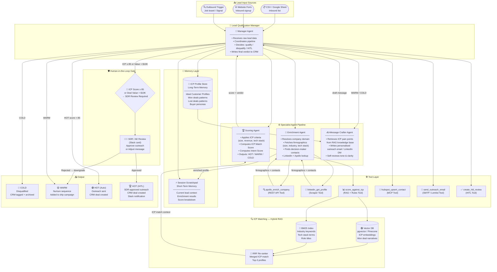
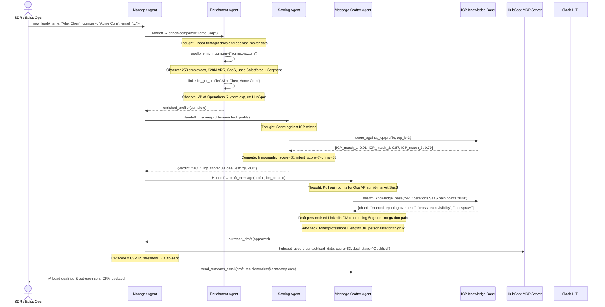

# 🏗️ Architecture Blueprint — Lead Qualification Multi-Agent System
**Sample Deliverable | Agentic AI Architecture Blueprint (Tier B)**
*Prepared by: Yevhen Shaforostov | Oracle Certified Agentic AI Foundations 2026*

> ⚠️ **Note:** Client name and domain-specific data have been redacted for portfolio use.

---

## 📋 Executive Summary

| Parameter | Value |
|---|---|
| **Use Case** | Automated B2B Lead Qualification & CRM Enrichment |
| **Agent Pattern** | Sequential Pipeline with Manager Coordination |
| **Framework** | LangChain LCEL + OpenAI Agents SDK |
| **Memory** | Long-Term ICP Profile Store + Session scratchpad |
| **RAG** | ICP Matching via Hybrid Vector Search |
| **HITL Gates** | 1 gate — High-Value Lead (ICP Score > 85) review before outreach |
| **MCP Integration** | HubSpot MCP Server (SSE transport) |
| **Estimated Cost** | ~$0.12–$0.35 per qualified lead |
| **Expected ROI** | 8–12× faster qualification vs manual SDR process |

---

## 🗺️ System Architecture Diagram



---

## 🔄 Sequence Diagram — Lead Qualification ReAct Loop



---

## 📋 Framework Selection — ADR-001

**Decision:** LangChain LCEL for pipeline orchestration + OpenAI Agents SDK for specialist agents.

| Framework | Sequential Pipeline | Tool Calling | Streaming | Memory Support | MCP Ready | Verdict |
|---|---|---|---|---|---|---|
| **LangChain LCEL** | ✅ Native (`\|` pipe) | ✅ | ✅ | ✅ | ✅ | ✅ **Orchestration layer** |
| **OpenAI Agents SDK** | ⚠️ Handoffs | ✅ Native | ✅ | ✅ | ✅ | ✅ **Specialist agents** |
| CrewAI | ✅ Sequential | ✅ | ❌ | ⚠️ | ❌ | ❌ No MCP |
| LangGraph | ✅ Graph | ✅ | ✅ | ✅ | ⚠️ | Runner-up — added complexity |

**Rationale:**
- LCEL's pipe operator (`prompt | model | parser`) is perfect for the linear Enrich → Score → Message pipeline.
- OpenAI Agents SDK's `handoff_description` enables declarative routing within each specialist agent.
- HubSpot MCP Server (official, SSE transport) eliminates custom REST wrapper code.

---

## 🛠️ Tool Definition Schemas

### Tool 1: `apollo_enrich_company`
```json
{
  "name": "apollo_enrich_company",
  "description": "Fetches firmographic data for a company using Apollo.io API. Use this as the FIRST enrichment step for any new lead. Returns: employee count, revenue estimate, industry, tech stack, funding stage, and key decision-maker contacts. Do NOT call linkedin_get_profile before calling this tool.",
  "parameters": {
    "type": "object",
    "properties": {
      "company_domain": {
        "type": "string",
        "description": "Company website domain (e.g. 'acmecorp.com'). Extract from email if not explicitly provided."
      },
      "desired_roles": {
        "type": "array",
        "items": { "type": "string" },
        "description": "List of decision-maker roles to search for (e.g. ['VP Operations', 'Head of Engineering', 'CTO'])",
        "default": ["CEO", "CTO", "VP Engineering", "Head of Product"]
      }
    },
    "required": ["company_domain"]
  }
}
```

### Tool 2: `score_against_icp`
```json
{
  "name": "score_against_icp",
  "description": "Computes an ICP (Ideal Customer Profile) match score for an enriched lead profile using hybrid vector search against historical won deals and defined ICP criteria. Returns a score from 0–100 and a verdict (HOT/WARM/COLD). Always call this AFTER apollo_enrich_company has returned results.",
  "parameters": {
    "type": "object",
    "properties": {
      "company_profile": {
        "type": "object",
        "description": "The enriched company profile object from apollo_enrich_company",
        "properties": {
          "employees": { "type": "integer" },
          "revenue_estimate_usd": { "type": "number" },
          "industry": { "type": "string" },
          "tech_stack": { "type": "array", "items": { "type": "string" } },
          "funding_stage": { "type": "string" }
        }
      },
      "contact_role": {
        "type": "string",
        "description": "The job title of the primary contact being evaluated"
      }
    },
    "required": ["company_profile", "contact_role"]
  }
}
```

### Tool 3: `hubspot_upsert_contact`
```json
{
  "name": "hubspot_upsert_contact",
  "description": "Creates or updates a contact and associated deal in HubSpot CRM. Call this AFTER scoring is complete and a verdict has been determined. Always include the icp_score and agent_verdict fields so sales reps have full context on why this lead was qualified.",
  "parameters": {
    "type": "object",
    "properties": {
      "email": { "type": "string" },
      "firstname": { "type": "string" },
      "lastname": { "type": "string" },
      "company": { "type": "string" },
      "icp_score": {
        "type": "integer",
        "description": "0–100 ICP match score from score_against_icp"
      },
      "agent_verdict": {
        "type": "string",
        "enum": ["HOT", "WARM", "COLD"],
        "description": "The Scoring Agent's qualification verdict"
      },
      "deal_stage": {
        "type": "string",
        "enum": ["Prospect", "Qualified", "Nurture", "Disqualified"],
        "description": "HubSpot pipeline stage to set for this contact"
      },
      "estimated_deal_value_usd": {
        "type": "number",
        "description": "Estimated deal size in USD based on company profile"
      }
    },
    "required": ["email", "company", "icp_score", "agent_verdict", "deal_stage"]
  }
}
```

### Tool 4: `create_hitl_review`
```json
{
  "name": "create_hitl_review",
  "description": "Sends a Slack approval card to the assigned SDR/AE for high-value leads. MUST be called when: (1) ICP score >= 85, OR (2) estimated deal value > $10,000. Do NOT send outreach email before this tool returns an 'approved' status for these leads.",
  "parameters": {
    "type": "object",
    "properties": {
      "lead_summary": {
        "type": "object",
        "properties": {
          "contact_name": { "type": "string" },
          "company": { "type": "string" },
          "role": { "type": "string" },
          "icp_score": { "type": "integer" },
          "estimated_deal_usd": { "type": "number" }
        }
      },
      "proposed_outreach_draft": {
        "type": "string",
        "description": "The Message Crafter Agent's draft outreach message for SDR review"
      },
      "assignee_slack_id": {
        "type": "string",
        "description": "Slack user ID of the SDR/AE responsible for this lead"
      }
    },
    "required": ["lead_summary", "proposed_outreach_draft", "assignee_slack_id"]
  }
}
```

---

## 🎯 ICP Scoring Matrix

| Criterion | Weight | Ideal Value | Scoring Rule |
|---|---|---|---|
| **Company Size** | 25% | 50–500 employees | 100pts if in range; -20 per 100 outside |
| **Industry Match** | 20% | SaaS / FinTech / Ops-heavy | 100 if exact; 60 if adjacent; 0 if mismatch |
| **Tech Stack Fit** | 20% | Uses Salesforce / HubSpot / Segment | +20pts per matching tool (max 100) |
| **Contact Seniority** | 20% | VP / Director / C-Level | VP/Director=100; Manager=60; IC=20 |
| **Intent Signals** | 15% | Hiring AI/Ops roles, recent funding | +15pts per detected signal (max 100) |

**Verdict Thresholds:**
- **HOT:** Score ≥ 75
- **WARM:** Score 45–74
- **COLD:** Score < 45

---

## 🛡️ HITL Policy

| Trigger | Risk | Gate | Timeout | Assignee |
|---|---|---|---|---|
| ICP Score ≥ 85 | 🟠 High-value opportunity | Slack card with draft preview | 4 hours → SDR notified again | Assigned SDR |
| Deal est. > $10,000 | 🟠 Enterprise opportunity | Slack card + CRM flag | 8 hours → Manager notified | AE + Sales Manager |
| Contact = C-Level | 🟡 Reputation risk | SDR must personalise | 2 hours → draft sent unchanged | Assigned SDR |
| Bounce / Invalid email | 🟡 Data quality | Auto-flag, no outreach | N/A — human resolves | Ops team |

---

## 💰 Token Economics Estimate

| Lead Type | Input Tokens | Output Tokens | Model | Cost / Lead |
|---|---|---|---|---|
| COLD (disqualified early) | ~800 | ~150 | gpt-4o-mini | **~$0.002** |
| WARM (scored + nurture) | ~3,200 | ~600 | gpt-4o-mini | **~$0.008** |
| HOT (full pipeline) | ~5,500 | ~1,200 | gpt-4o | **~$0.082** |
| HOT + HITL review | ~6,000 | ~1,400 | gpt-4o | **~$0.095** |

**Blended estimate** (40% COLD, 40% WARM, 20% HOT):
> **~$0.022 per lead processed** — vs $25–$80 per qualified lead for manual SDR time.

**Semantic caching:** Top 20% repeated company enrichment queries cached in Redis → saves ~35% on enrichment API calls.

---

## 🚀 Implementation Roadmap

```
Week 1 (Setup & Enrichment Layer):
  ├── Configure Apollo.io API + LinkedIn scraper (legal check)
  ├── Build Enrichment Agent with apollo_enrich_company tool
  ├── Set up pgvector ICP Profile Store + load historical won/lost deals
  └── Deploy HubSpot MCP Server (SSE transport)

Week 2 (Scoring & Messaging Layer):
  ├── Build Scoring Agent + ICP scoring matrix rules
  ├── Implement Hybrid Search for ICP matching (Dense + BM25 + RRF)
  ├── Build Message Crafter Agent with Self-Reflection loop
  └── Wire HITL Slack card (Block Kit) with approve/reject callbacks

Week 3 (Integration & Eval):
  ├── End-to-end pipeline test: 50 real leads from client's historical data
  ├── Eval: compare agent scores vs SDR historical verdicts (agreement rate target: ≥ 80%)
  ├── Tune ICP scoring weights based on calibration results
  └── Load test + handoff documentation
```

---

*Document version: 1.0 | Prepared: August 2026*
*Oracle Certified Agentic AI Foundations Associate (1Z0-1157-26)*
