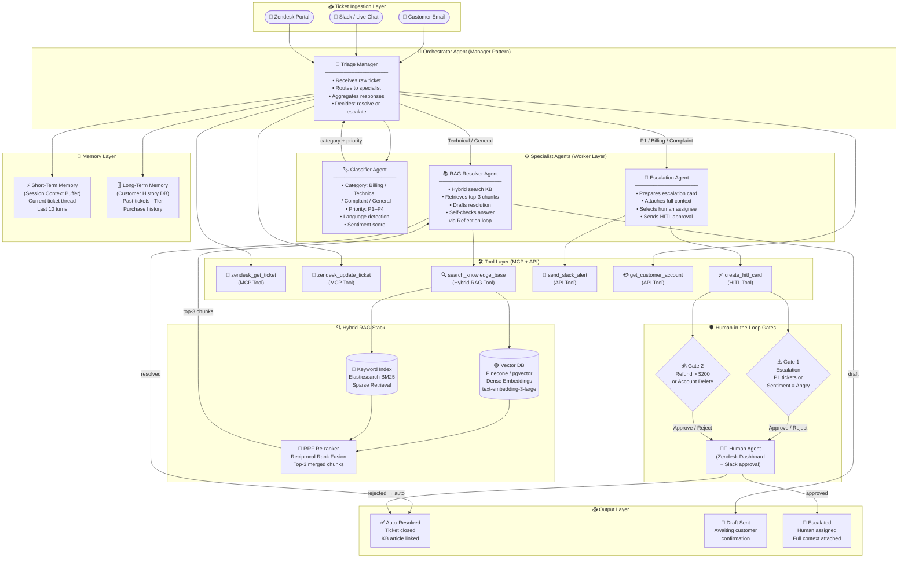
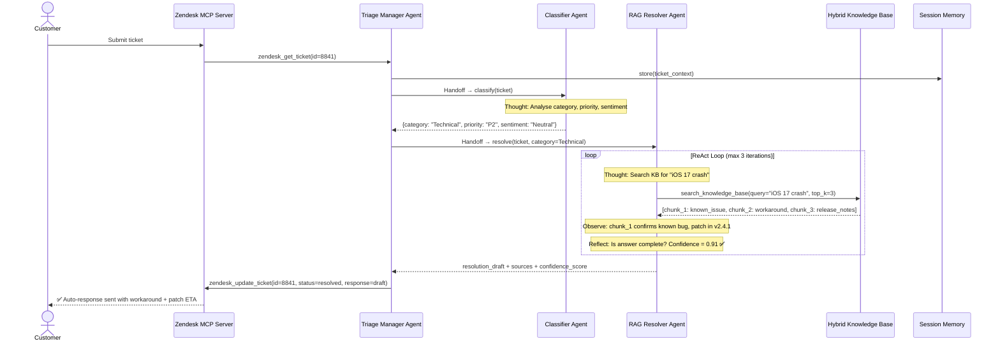

# 🏗️ Architecture Blueprint — Support Triage Multi-Agent System
**Sample Deliverable | Agentic AI Architecture Blueprint (Tier B)**
*Prepared by: Yevhen Shaforostov | Oracle Certified Agentic AI Foundations 2026*

> ⚠️ **Note:** Client name and domain-specific data have been redacted for portfolio use.
> This document represents the standard output of a Tier B Architecture Blueprint engagement.

---

## 📋 Executive Summary

| Parameter | Value |
|---|---|
| **Use Case** | Customer Support Triage & Resolution |
| **Agent Pattern** | Hierarchical Manager-Worker with Handoffs |
| **Framework** | OpenAI Agents SDK + LangChain Tools |
| **Memory** | Short-term (session) + Long-term (customer history) |
| **RAG** | Hybrid Search — Dense + BM25 + RRF Re-ranking |
| **HITL Gates** | 2 approval gates (escalation + refund > $200) |
| **MCP Integration** | Zendesk MCP Server (stdio transport) |
| **Estimated Cost** | ~$0.04–$0.09 per resolved ticket |

---

## 🗺️ System Architecture Diagram



---

## 🔄 Sequence Diagram — ReAct Agent Loop (Happy Path)



---

## 📋 Framework Selection — Architecture Decision Record (ADR-001)

**Decision:** Use **OpenAI Agents SDK** as the primary orchestration framework.

| Framework | Tool Calling | Handoffs | Streaming | MCP Support | Learning Curve | Verdict |
|---|---|---|---|---|---|---|
| **OpenAI Agents SDK** | ✅ Native | ✅ Native | ✅ | ✅ via MCP Calling | Low | ✅ **Selected** |
| LangGraph | ✅ Native | ⚠️ Manual graph | ✅ | ⚠️ Custom | Medium | Runner-up |
| CrewAI | ✅ | ✅ | ❌ | ❌ | Low | ❌ No MCP |
| AutoGen | ✅ | ✅ | ⚠️ | ❌ | High | ❌ Overhead |

**Rationale:**
- Client already has OpenAI API contract → zero additional vendor onboarding.
- `handoff_description` field enables declarative routing without custom graph state management.
- Native MCP Calling tool eliminates custom connector code for Zendesk integration.
- Runner executes the ReAct loop out-of-the-box — no custom orchestration logic.

---

## 🛠️ Tool Definition Schemas

### Tool 1: `zendesk_get_ticket`
```json
{
  "name": "zendesk_get_ticket",
  "description": "Retrieves a Zendesk support ticket by ID. Use when you need to read ticket content, customer information, or current status before taking any action.",
  "parameters": {
    "type": "object",
    "properties": {
      "ticket_id": {
        "type": "integer",
        "description": "The unique Zendesk ticket ID"
      }
    },
    "required": ["ticket_id"]
  }
}
```

### Tool 2: `search_knowledge_base`
```json
{
  "name": "search_knowledge_base",
  "description": "Performs hybrid search (dense vector + BM25 keyword) over the internal knowledge base. Use when resolving a customer issue that may be covered by existing documentation, known bugs, or FAQs. Always call this before drafting a response.",
  "parameters": {
    "type": "object",
    "properties": {
      "query": {
        "type": "string",
        "description": "The customer's issue reformulated as a search query"
      },
      "top_k": {
        "type": "integer",
        "description": "Number of chunks to retrieve (default: 3, max: 5)",
        "default": 3
      },
      "category_filter": {
        "type": "string",
        "enum": ["technical", "billing", "general", "all"],
        "description": "Filter results to a specific support category",
        "default": "all"
      }
    },
    "required": ["query"]
  }
}
```

### Tool 3: `create_hitl_card`
```json
{
  "name": "create_hitl_card",
  "description": "Creates a Human-in-the-Loop approval card in Slack for high-risk actions. MUST be called before: (1) issuing refunds over $200, (2) deleting customer accounts, (3) escalating a P1 ticket to engineering. Do NOT auto-resolve without calling this tool for these scenarios.",
  "parameters": {
    "type": "object",
    "properties": {
      "ticket_id": {
        "type": "integer",
        "description": "The Zendesk ticket ID requiring human review"
      },
      "action_type": {
        "type": "string",
        "enum": ["refund", "account_delete", "p1_escalation", "legal_flag"],
        "description": "The category of high-risk action requiring approval"
      },
      "action_value": {
        "type": "number",
        "description": "Monetary value for refund actions (USD). Use 0 for non-financial actions."
      },
      "agent_reasoning": {
        "type": "string",
        "description": "The agent's explanation of why this action is recommended (max 300 chars)"
      }
    },
    "required": ["ticket_id", "action_type", "agent_reasoning"]
  }
}
```

---

## 🛡️ Human-in-the-Loop (HITL) Policy

| Trigger Condition | Risk Level | Gate Mechanism | Timeout Behaviour | Assignee |
|---|---|---|---|---|
| Ticket priority = P1 | 🔴 Critical | Slack card + PagerDuty | 5 min → auto-escalate to manager | On-call engineer |
| Refund amount > $200 | 🟠 High | Slack card with Approve/Reject | 2 hours → reject & notify customer | Finance team |
| Account delete request | 🔴 Critical | Slack card + email confirmation | 24 hours → keep account, notify | Senior support |
| Sentiment = "Threatening" | 🔴 Critical | Immediate Slack alert | No timeout — human must act | Support manager |
| Confidence score < 0.70 | 🟡 Medium | Draft flagged for review | 1 hour → send draft anyway with disclaimer | Any support agent |

---

## 🔍 RAG & Memory Strategy

### Vector Store Configuration
| Parameter | Value | Rationale |
|---|---|---|
| **Embedding Model** | `text-embedding-3-large` (3072-dim) | Best retrieval quality for technical support docs |
| **Vector DB** | Pinecone (serverless) | Managed, scales to 1M+ vectors without ops overhead |
| **Chunk Size** | 400 tokens | Balances context completeness vs retrieval precision |
| **Overlap** | 50 tokens | Prevents context loss at chunk boundaries |
| **Metadata Fields** | `category`, `product_version`, `created_at`, `doc_type` | Enables pre-filtering before vector search |

### Hybrid Search Config
```
Query → [Dense Search: text-embedding-3-large]  → Top-10 dense results  ─┐
       → [BM25 Keyword Search: Elasticsearch]   → Top-10 sparse results ─┤ → RRF Merge → Top-3 final chunks → LLM
                                                                           ┘
RRF Score = Σ 1 / (k + rank_i)  where k = 60 (standard constant)
```

### Memory Architecture
| Type | Storage | TTL | Use |
|---|---|---|---|
| **Short-Term** | In-process context buffer | Session only | Current ticket thread, last 10 agent turns |
| **Long-Term** | PostgreSQL + pgvector | Indefinite | Customer tier, past ticket summaries, known preferences |

---

## 💰 Token Economics Estimate

| Scenario | Input Tokens | Output Tokens | Model | Cost / Ticket |
|---|---|---|---|---|
| Auto-resolved (simple) | ~1,200 | ~300 | gpt-4o-mini | **~$0.003** |
| Auto-resolved (with RAG) | ~3,500 | ~500 | gpt-4o-mini | **~$0.009** |
| Escalated (HITL triggered) | ~4,500 | ~700 | gpt-4o | **~$0.058** |
| P1 emergency (full context) | ~6,000 | ~1,000 | gpt-4o | **~$0.085** |

**Estimated blended cost** (assuming 70% auto-resolve, 30% escalated):
> **~$0.025 per ticket** — compared to $6–$15 industry average for human agent handling.

**Caching opportunities:**
- System prompt + KB metadata → Prompt Cache → saves ~40% on input tokens.
- Frequent queries (top 50 issues) → Semantic Cache (Redis) → saves ~60% on repeat queries.

---

## 🚀 Implementation Roadmap (suggested sprint plan)

```
Week 1 (Architecture & Setup):
  ├── Set up OpenAI Agents SDK project structure
  ├── Deploy Zendesk MCP Server (stdio transport)
  ├── Configure Pinecone index + load KB documents
  └── Implement Classifier Agent + unit tests

Week 2 (Core Agent Development):
  ├── Build RAG Resolver Agent with Hybrid Search
  ├── Implement Reflection Self-Check loop (confidence scoring)
  ├── Build HITL Card generator (Slack Block Kit)
  └── Wire Triage Manager (Handoffs + routing logic)

Week 3 (Testing & Hardening):
  ├── Eval suite: 25 scenarios (happy path + edge cases + adversarial)
  ├── LLM-as-a-Judge: automated quality scoring
  ├── Prompt injection tests + guardrail validation
  └── Load test: 100 concurrent tickets
```

---

*Document version: 1.0 | Prepared: August 2026*
*Oracle Certified Agentic AI Foundations Associate (1Z0-1157-26)*
