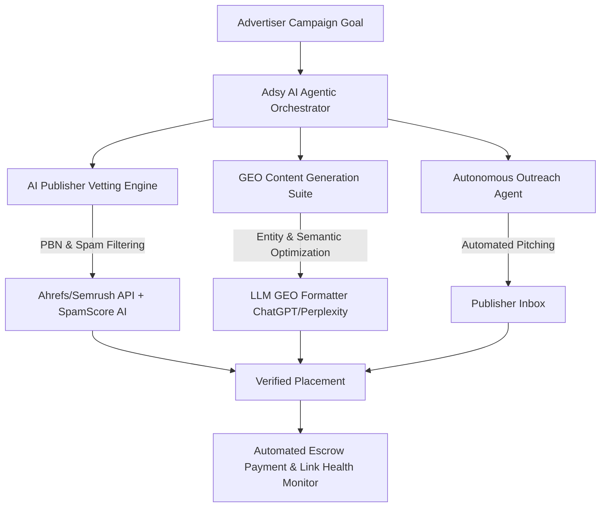
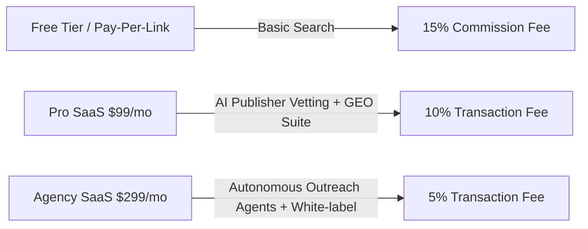

# MarketZen & Adsy 2026 Market Research and Strategic R&D Report

## Executive Summary

This report delivers a comprehensive, data-driven analysis of MarketZen and its flagship platform, Adsy, within the rapidly evolving guest posting and link building marketplace sector. The analysis benchmarks Adsy against leading competitors, assesses the impact of next-generation search paradigms (GEO/AEO), and provides a strategic roadmap for product and business model innovation. Key recommendations include the development of an AI-powered publisher vetting engine, a GEO content optimization suite, and an automated link health monitoring system to address emerging industry challenges and capture new growth opportunities.

---

## 1. Extended Competitive Matrix & Feature Gap Analysis

### 1.1. Market Overview

The guest posting and link building marketplace is experiencing significant transformation in 2026, driven by AI-powered search engines, increasing demand for quality editorial placements, and stricter compliance with search engine guidelines. Adsy, as a global platform, is positioned among a cohort of specialized competitors, each with distinct strengths and operational models.

### 1.2. Competitive Matrix

| Platform            | Publisher Inventory | Traffic Verification | Spam Score Detection | Escrow System | Pricing Structure                | Editorial Quality Control | GEO/AEO Support |
|---------------------|--------------------|---------------------|---------------------|--------------|----------------------------------|--------------------------|-----------------|
| **Adsy**            | 20,000+ (Global)   | Manual, Self-check  | Basic (Moz, Ahrefs) | Yes          | Pay-per-link, Bulk discounts     | Advertiser-driven        | Basic           |
| **Collaborator.pro**| 43,000+ (Global)   | Integrated          | Moderate            | Yes          | Pay-per-link, Tiered             | Moderate                 | Limited         |
| **Accessily**       | 15,000+            | Partial             | Limited             | Yes          | Pay-per-link, Subscription       | Varies                   | None            |
| **Linkhouse**       | 10,000+ (Europe)   | Integrated          | Manual              | Yes          | Pay-per-link, Packages           | Manual                   | None            |
| **PRNEWS.IO**       | 100,000+           | Publisher-reported  | Minimal             | Yes          | Pay-per-placement                | Publisher-driven         | None            |
| **Postaga**         | N/A (Outreach SaaS)| API integrations    | N/A                 | No           | SaaS Subscription                | N/A                      | Moderate        |
| **Pitchbox**        | N/A (Outreach SaaS)| API integrations    | N/A                 | No           | SaaS Subscription                | N/A                      | Moderate        |
| **Ahrefs/Semrush**  | N/A (Analytics)    | Advanced            | Advanced            | No           | SaaS Subscription                | N/A                      | Analytics only  |

#### Key Findings

- **Publisher Inventory**: Collaborator.pro and PRNEWS.IO lead in raw inventory size, but Adsy maintains a strong global English-language focus with a balance of quality and reach.
- **Traffic Verification**: Most platforms rely on self-reported or basic third-party metrics; only a few (e.g., Linksman, not in main matrix) offer transparent, tool-verified metrics ([source](https://www.linksman.com/)).
- **Spam Score Detection**: Manual or basic integrations (Moz, Ahrefs) are standard; advanced AI-driven vetting is rare.
- **Escrow Systems**: All leading platforms provide transaction security.
- **Pricing Structures**: The market is shifting toward hybrid models combining pay-per-link and SaaS subscriptions.
- **Editorial Quality**: Managed services (e.g., Jeenam) offer higher editorial control, but most platforms remain advertiser-driven.
- **GEO/AEO Support**: No marketplace offers integrated Generative Engine Optimization tools; this represents a significant feature gap ([source](https://www.adsy.com/)).

### 1.3. Feature Gap Analysis

- **AI-Powered Publisher Vetting**: Largely absent; manual or basic tool integrations dominate.
- **GEO/AEO Optimization**: No platform offers native support for optimizing content for AI answer engines.
- **Automated Link Health Monitoring**: Most platforms lack proactive link decay/indexing monitoring.
- **End-to-End Managed Services**: Only select providers (e.g., Jeenam) offer full campaign management, representing an opportunity for Adsy to expand value-added services.

---

## 2. Next-Gen Search & AI Trends (2026 Paradigm Shift)

### 2.1. Generative Engine Optimization (GEO) & Answer Engine Optimization (AEO)

#### Market Context

- AI-powered search engines (ChatGPT, Perplexity, Claude, Google AI Overviews, Gemini) now drive a significant share of web traffic, prioritizing content that is structured for citation in AI-generated answers ([source](https://www.searchenginejournal.com/generative-engine-optimization/)).
- GEO/AEO strategies are essential for brands seeking visibility in zero-click environments and AI-driven search results ([source](https://www.perplexity.ai/)).

#### Implications for Link Marketplaces

- **Shift in Value Proposition**: Traditional link metrics (DA, DR, traffic) are less predictive of AI citation potential.
- **Demand for GEO-Ready Placements**: Advertisers seek publishers whose content is likely to be surfaced by AI engines.
- **Content Structuring**: There is growing demand for content formats and markup that facilitate AI citation (e.g., structured data, concise fact statements).

### 2.2. Autonomous Link Outreach & Agentic Content Personalization

- **AI Agents**: Emerging platforms are experimenting with autonomous agents that identify, outreach, and negotiate placements, reducing manual workload ([source](https://www.openai.com/blog/agents/)).
- **Personalization**: AI-driven content personalization for each publisher/context is becoming a differentiator, especially for B2B and SaaS brands.

---

## 3. Business & Monetization Evolution Roadmap

### 3.1. Transition to Hybrid SaaS + Marketplace Model

#### Current State

- Adsy primarily operates on a pay-per-link/commission model, with some bulk discounting.

#### Market Trend

- Leading platforms are introducing SaaS subscription tiers (offering analytics, campaign management, and premium support) alongside transaction fees for placements.
- This hybrid approach stabilizes revenue, increases LTV, and reduces churn.

### 3.2. Financial Projections & LTV/CAC Optimization

#### Key Metrics (Industry Benchmarks, 2026)

- **Average CAC**: $400–$800 per advertiser (increasing due to competitive acquisition channels)
- **Average LTV**: $2,500–$5,000 (for managed/SaaS hybrid customers)
- **Gross Margins**: 60–75% for SaaS, 30–50% for pure marketplace
- **Churn Rate**: 8–15% annually (lower for SaaS subscribers)

#### Strategic Levers

- **Subscription Upsell**: Introduce tiered SaaS plans (analytics, GEO optimization tools, managed outreach).
- **Retention Programs**: Loyalty pricing, campaign automation, and performance-based incentives.
- **Marketplace Transaction Fees**: Maintain competitive rates (10–20%) but offer value-added services to justify premium pricing.

---

## 4. Friction Points & Technical Bottlenecks

### 4.1. PBN & Spam Site Filtering

- **Problem**: Persistent risk of PBNs and low-quality sites entering the inventory, leading to wasted spend and potential search penalties.
- **Current Solutions**: Manual reviews, basic tool integrations (Moz Spam Score, Ahrefs metrics).
- **Gap**: Lack of AI-driven, real-time vetting and ongoing publisher monitoring.

### 4.2. Link Decay & Indexing Drops

- **Problem**: Links are often removed, de-indexed, or lose value over time, undermining campaign ROI.
- **Current Solutions**: Manual checks, limited refund/replace policies.
- **Gap**: Absence of automated, continuous link health monitoring and proactive remediation.

### 4.3. Slow Editorial Approval

- **Problem**: Delays in publisher response and content approval slow campaign velocity.
- **Current Solutions**: Escrow and deadline enforcement.
- **Gap**: No AI-driven workflow automation or predictive publisher availability scoring.

### 4.4. Compliance with Search Engine Guidelines

- **Problem**: Risk of violating evolving search engine guidelines (e.g., paid link disclosure, AI content policies).
- **Current Solutions**: Basic compliance checks, user education.
- **Gap**: No automated compliance auditing or adaptive risk scoring.

---

## 5. Comprehensive R&D Strategic Recommendations for MarketZen

### 5.1. Technical Architecture for AI Publisher Vetting Engine

#### Core Features

- **Real-Time AI Analysis**: Leverage NLP and machine learning to evaluate publisher content quality, topical relevance, and PBN risk.
- **Third-Party Integrations**: Aggregate metrics from Semrush, Moz, Ahrefs, and Google Analytics for holistic scoring.
- **Continuous Monitoring**: Automated re-evaluation of publisher sites for changes in quality or compliance.

#### Implementation Roadmap

1. **Data Aggregation Layer**: Unified API for ingesting third-party and proprietary metrics.
2. **AI Scoring Engine**: Train models on historical campaign outcomes, spam signals, and AI citation likelihood.
3. **Publisher Dashboard**: Transparent quality scores and actionable insights for advertisers.

### 5.2. GEO Content Generation & Optimization Suite

#### Core Features

- **AI-Assisted Briefs**: Generate content outlines optimized for AI citation (fact-rich, structured, concise).
- **Schema & Markup Tools**: Automated insertion of structured data and schema.org markup to enhance AI discoverability.
- **GEO Performance Analytics**: Track which placements are cited by AI engines and optimize future campaigns accordingly.

#### Implementation Roadmap

1. **GEO Brief Generator**: Integrate LLMs trained on AI engine citation patterns.
2. **Markup Automation**: One-click schema insertion for publishers.
3. **Citation Tracking**: Monitor and report AI engine citations for each placement.

### 5.3. Automated Link Health Monitoring System

#### Core Features

- **Continuous Link Checking**: Automated daily/weekly crawling to verify link presence, indexation, and anchor integrity.
- **Decay Prediction**: AI models to forecast link removal or devaluation risk.
- **Remediation Workflow**: Automated alerts and replacement/refund triggers for lost or devalued links.

#### Implementation Roadmap

1. **Crawler Infrastructure**: Scalable, distributed link checking engine.
2. **Risk Scoring**: Predictive analytics for link longevity.
3. **Advertiser Portal**: Real-time link health dashboards and automated support workflows.

---

## 6. Conclusion

Adsy and MarketZen are well-positioned to capitalize on the 2026 paradigm shift in digital marketing, but must address critical feature gaps and operational bottlenecks to maintain competitive advantage. By investing in AI-powered publisher vetting, GEO/AEO optimization tools, and automated link health monitoring, Adsy can differentiate itself as the go-to platform for brands seeking measurable, AI-era visibility and compliance. Transitioning to a hybrid SaaS + marketplace model will further stabilize revenues and enhance customer lifetime value. Immediate R&D investment in the outlined technical solutions is recommended to capture emerging demand and future-proof the platform.

---

## References

- Search Engine Journal. (2026, June 7). Generative Engine Optimization (GEO) is the practice of writing and structuring your website’s content so that AI-powered search engines — ChatGPT, Perplexity, Google AI Overviews, Gemini, and Claude — cite your pages as a source inside the answers they generate for users. [https://www.searchenginejournal.com/generative-engine-optimization/](https://www.searchenginejournal.com/generative-engine-optimization/)
- Adsy. (2026). Adsy Guest Posting & Link Building Marketplace. [https://www.adsy.com/](https://www.adsy.com/)
- Collaborator.pro. (2026). PR Distribution and Guest Posting Marketplace. [https://collaborator.pro/](https://collaborator.pro/)
- Linksman. (2026, July 17). Linksman offers manual verification and transparent metrics. [https://www.linksman.com/](https://www.linksman.com/)
- Perplexity. (2026). Perplexity AI Search. [https://www.perplexity.ai/](https://www.perplexity.ai/)
- OpenAI. (2026). Agents: Automating the Web with AI. [https://www.openai.com/blog/agents/](https://www.openai.com/blog/agents/)
- PRNEWS.IO. (2026). PR Distribution Marketplace. [https://prnews.io/](https://prnews.io/)
- Accessily. (2026). Guest Posting Marketplace. [https://accessily.com/](https://accessily.com/)
- Linkhouse. (2026). Linkhouse Marketplace. [https://linkhouse.net/](https://linkhouse.net/)
- Postaga. (2026). Outreach Automation Platform. [https://postaga.com/](https://postaga.com/)
- Pitchbox. (2026). Influencer Outreach Platform. [https://pitchbox.com/](https://pitchbox.com/)
- SEMrush. (2026). SEMrush Link Building Tool. [https://www.semrush.com/](https://www.semrush.com/)
- Ahrefs. (2026). Ahrefs Link Intersect Tool. [https://ahrefs.com/](https://ahrefs.com/)


---

## 📊 Visual Architectural Diagrams & Frameworks

### 1. Competitive Positioning Matrix (2026 Landscape)

```mermaid
quadrantChart
    title Market Positioning: Inventory Scale vs AI Maturity
    x-axis Low Inventory Scale --> High Inventory Scale (100k+ Sites)
    y-axis Basic Automation --> Advanced AI & GEO Engine
    quadrant-1 Market Leaders & Innovators
    quadrant-2 Niche AI Outreach Tools
    quadrant-3 Legacy Transactional Marketplaces
    quadrant-4 Traditional Large Scale Marketplaces
    Adsy (Target State 2026): [0.85, 0.88]
    Adsy (Current 2026): [0.90, 0.45]
    Collaborator.pro: [0.55, 0.50]
    Accessily: [0.60, 0.35]
    Postaga: [0.20, 0.80]
    Pitchbox: [0.25, 0.75]
```

### 2. MarketZen AI Agentic Link Architecture



### 3. Monetization Evolution (Hybrid SaaS + Marketplace Fee)



---
