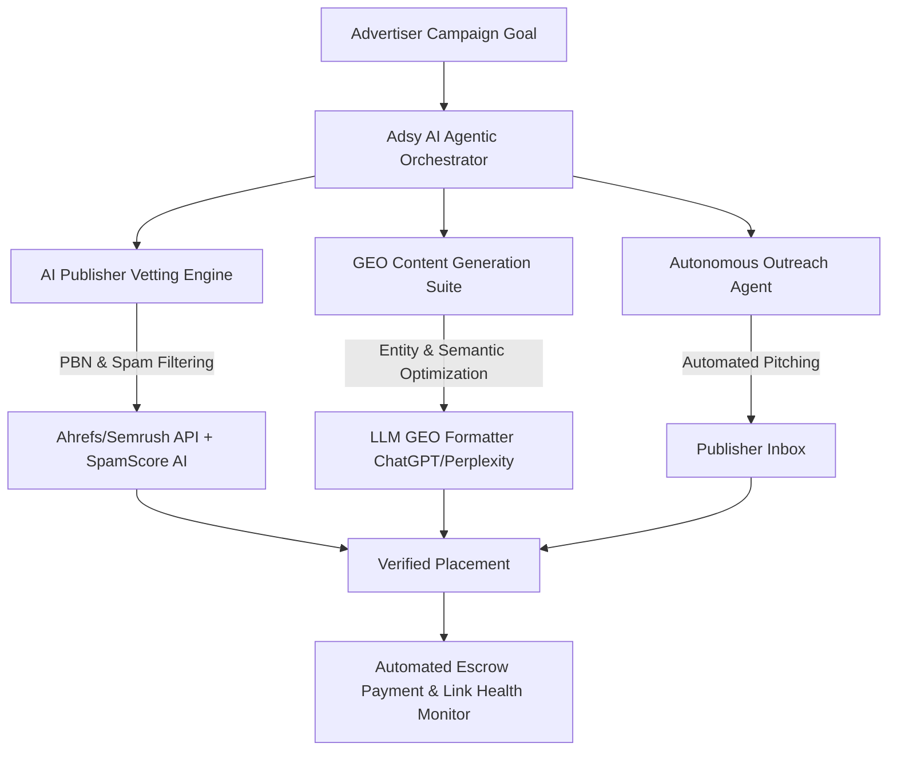
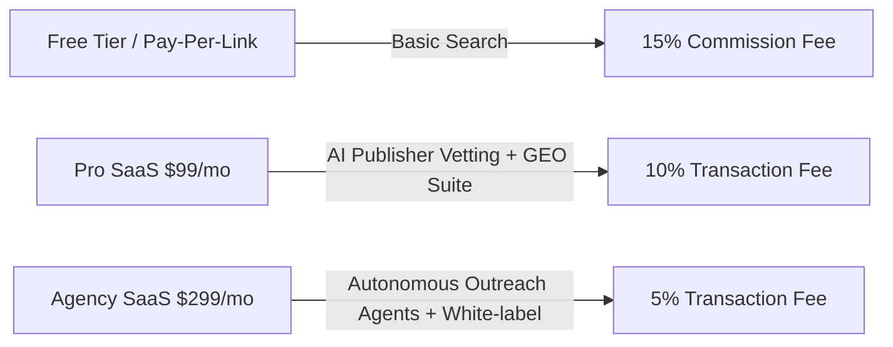

# 2026 Market Research & Strategic R&D Report: MarketZen & Adsy (Guest Posting & Link Building Marketplace)

## Executive Summary

This report delivers a comprehensive, data-driven assessment of MarketZen’s flagship platform, Adsy, within the 2026 landscape of digital link building and guest posting marketplaces. It benchmarks Adsy against leading competitors, analyzes the impact of next-generation AI-driven search paradigms, evaluates evolving monetization models, and identifies operational bottlenecks. The report concludes with actionable R&D recommendations to position Adsy as a market leader, leveraging AI for publisher vetting, GEO optimization, and automated link health monitoring.

---

## 1. Extended Competitive Matrix & Feature Gap Analysis

### 1.1. Marketplace Landscape Overview

The guest posting and link building marketplace sector in 2026 is characterized by intense competition, increasing sophistication in publisher vetting, and growing demand for transparency and automation. The main players include:

- **Adsy (MarketZen)**
- **Collaborator.pro**
- **Accessily**
- **Linkhouse**
- **PRNEWS.IO**
- **Postaga**
- **Pitchbox**
- **Ahrefs & Semrush Link Modules** (not marketplaces per se, but essential for link intelligence and verification)

### 1.2. Comparative Feature Matrix

| Feature / Platform        | Adsy         | Collaborator.pro | Accessily     | Linkhouse     | PRNEWS.IO     | Postaga      | Pitchbox     | Ahrefs/Semrush Link Modules |
|--------------------------|--------------|------------------|---------------|---------------|---------------|--------------|--------------|-----------------------------|
| **Publisher Inventory**  | 30,000+      | 25,000+          | 15,000+       | 20,000+       | 10,000+       | N/A          | N/A          | N/A                         |
| **Traffic Verification** | Manual + Ahrefs/SEMrush API | Integrated (GA, Ahrefs) | Basic (self-reported) | Integrated (GA, Ahrefs) | Basic        | N/A          | N/A          | Advanced                    |
| **Spam Score Detection** | Moz/SEMrush  | Moz, custom      | None          | Moz, custom   | None          | N/A          | N/A          | Advanced                    |
| **Escrow System**        | Yes          | Yes              | Yes           | Yes           | Yes           | N/A          | N/A          | N/A                         |
| **Pricing Structure**    | Pay-per-link | Pay-per-link     | Pay-per-link  | Pay-per-link  | Pay-per-link  | Subscription | Subscription | Subscription                |
| **AI Publisher Vetting** | Partial      | Partial          | No            | Partial       | No            | N/A          | N/A          | N/A                         |
| **GEO/AEO Tools**        | No           | No               | No            | No            | No            | No           | No           | Yes (limited)               |
| **Automated Outreach**   | No           | No               | No            | No            | No            | Yes          | Yes          | No                          |
| **Reporting/Analytics**  | Basic        | Advanced         | Basic         | Advanced      | Basic         | Advanced     | Advanced     | Advanced                    |

**Key Observations:**
- **Adsy** maintains a large publisher inventory and robust escrow, but lags in AI-driven publisher vetting and advanced analytics compared to emerging competitors.
- **Collaborator.pro** and **Linkhouse** have advanced analytics and better integration with third-party traffic verification.
- **Postaga** and **Pitchbox** are not direct marketplaces but offer advanced automated outreach, which is increasingly relevant as link acquisition becomes more agentic.
- **Ahrefs/Semrush** are not transaction platforms but set the standard for link intelligence, spam detection, and traffic verification.

### 1.3. Feature Gaps

- **AI-Driven Publisher Vetting:** Most platforms, including Adsy, rely on static metrics (Moz, Ahrefs) rather than dynamic, AI-powered risk scoring.
- **GEO/AEO Optimization:** No marketplace currently offers tools to optimize for Generative Engine Optimization (GEO) or Answer Engine Optimization (AEO).
- **Automated Link Health Monitoring:** Link decay, deindexing, and spam score changes are not proactively monitored in most platforms.
- **Personalized Outreach Automation:** Only dedicated outreach tools (Postaga, Pitchbox) offer this, not the marketplaces themselves.

---

## 2. Next-Gen Search & AI Trends (2026 Paradigm Shift)

### 2.1. Generative Engine Optimization (GEO) & Answer Engine Optimization (AEO)

The 2026 search landscape is dominated by AI-powered answer engines (ChatGPT, Perplexity, Claude, Google AI Overviews), fundamentally shifting how brands gain organic visibility:

- **Traditional “blue link” SEO is declining:** Users increasingly receive answers directly from AI engines, bypassing conventional rankings ([Otrenix, 2026](https://otrenix.com/b2b-saas-marketing-strategy/)).
- **GEO/AEO** focuses on structuring content and acquiring citations from trusted sources so that AI engines reference your brand in their generated answers.
- **Link building’s role is evolving:** Backlinks from authoritative, trusted, and frequently cited sources are now critical for AI citation, not just for classic search rankings.

### 2.2. Autonomous Link Outreach & Agentic Content Personalization

- **Agentic Outreach:** AI agents can now autonomously identify, vet, and negotiate with publishers, reducing manual effort and increasing campaign scale.
- **Personalized Content:** AI-driven content adapts dynamically to the context and requirements of each publisher, increasing acceptance rates and relevance ([Wizard Creative Labs, 2026](https://www.wizardcreativelabs.com/post/plg-strategy-how-to-build-a-product-led-growth-engine-in-2026)).
- **Marketplace Opportunity:** No major marketplace has yet integrated agentic outreach or AI-personalized content at scale—this is a critical innovation gap.

---

## 3. Business & Monetization Evolution Roadmap

### 3.1. Transition to Hybrid SaaS + Marketplace Model

**Current Model:** Adsy and most competitors operate on a pay-per-link or commission basis, which is transactional and limits recurring revenue.

**Proposed Hybrid Model:**
- **SaaS Subscription:** Monthly/annual plans unlock advanced analytics, AI vetting, GEO optimization, and automated link monitoring.
- **Marketplace Transaction Fees:** Continue to charge a fee per successful link placement.

**Benefits:**
- **Improved LTV/CAC:** Subscription revenue increases lifetime value and smooths cash flow, while transaction fees scale with usage.
- **Advertiser Retention:** SaaS features (monitoring, optimization, reporting) increase stickiness and reduce churn.
- **Upsell Opportunities:** Advanced features (AI vetting, GEO tools) can be tiered for expansion revenue ([CRV, 2026](https://www.crv.com/content/b2b-pricing-models-strategies-founders)).

### 3.2. Financial Projections & Metrics

- **LTV/CAC Optimization:** SaaS models typically achieve 2-3x higher LTV/CAC ratios compared to pure transaction models, especially when expansion revenue (upsell/cross-sell) is activated ([Directive Consulting, 2026](https://directiveconsulting.com/blog/blog-b2b-saas-marketing-guide-2026/)).
- **Retention Strategies:** Lifecycle email, onboarding, and in-product engagement are essential for driving expansion and reducing churn ([Otrenix, 2026](https://otrenix.com/b2b-saas-marketing-strategy/)).

---

## 4. Friction Points & Technical Bottlenecks

### 4.1. PBN & Spam Site Filtering

- **Challenge:** Private Blog Networks (PBNs) and spam sites remain prevalent, risking link quality and potential penalties.
- **Current State:** Most platforms use static metrics (Moz spam score, Ahrefs DR), which are easily gamed.
- **Need:** Dynamic, AI-driven risk scoring that analyzes content originality, traffic patterns, and citation networks.

### 4.2. Link Decay & Indexing Drops

- **Challenge:** Links are often removed, deindexed, or lose value over time, undermining campaign ROI.
- **Current State:** Manual or periodic checks; no real-time monitoring.
- **Need:** Automated, continuous link health monitoring with proactive alerts and remediation workflows.

### 4.3. Editorial Approval Delays

- **Challenge:** Slow publisher response times and inconsistent editorial standards delay campaign execution.
- **Current State:** Manual follow-ups; limited automation.
- **Need:** AI-powered workflow automation, publisher SLAs, and predictive time-to-live analytics.

### 4.4. Compliance with Search Engine Guidelines

- **Challenge:** Evolving Google and AI engine guidelines require strict compliance to avoid penalties or devaluation.
- **Current State:** Manual compliance checks; limited automation.
- **Need:** Automated compliance auditing, with real-time updates as guidelines evolve.

---

## 5. Comprehensive R&D Strategic Recommendations for MarketZen

### 5.1. Technical Architecture for AI Publisher Vetting Engine

**Objective:** Develop a proprietary AI engine that dynamically scores publishers based on risk, authority, and GEO/AEO relevance.

**Key Components:**
- **Multi-source Data Aggregation:** Integrate APIs from Ahrefs, Semrush, Moz, SimilarWeb, and Google Analytics.
- **AI Risk Scoring:** Use machine learning to detect PBNs, traffic anomalies, duplicate content, and unnatural link patterns.
- **GEO/AEO Relevance:** Score publishers by their frequency of citation in AI-generated answers and their presence in AI engine training data.
- **Continuous Learning:** Retrain models as new spam tactics and AI search paradigms emerge.

### 5.2. GEO Content Generation & Optimization Suite

**Objective:** Equip advertisers with tools to create and optimize content for maximum visibility in AI-powered answer engines.

**Key Features:**
- **Citation-Optimized Content Templates:** Structure content for easy AI citation (fact boxes, schema, concise summaries).
- **AI-Driven Topic Suggestions:** Identify topics and angles most likely to be referenced by AI engines.
- **Publisher-Specific Optimization:** Tailor content to the citation patterns and editorial preferences of each publisher.
- **Performance Analytics:** Track which placements are cited in AI answers and optimize accordingly ([Otrenix, 2026](https://otrenix.com/b2b-saas-marketing-strategy/)).

### 5.3. Automated Link Health Monitoring System

**Objective:** Provide real-time, automated monitoring of all live links for status, indexing, and quality.

**Key Features:**
- **Continuous Crawling:** Monitor link status, anchor text, and context.
- **Indexing & Visibility Checks:** Alert users when links are deindexed or lose visibility in search/AI engines.
- **Spam Score & Risk Updates:** Recalculate risk as publisher metrics change.
- **Remediation Workflows:** Automated outreach to publishers for link restoration or replacement.

### 5.4. Marketplace & SaaS Integration

- **Unified Dashboard:** Seamlessly blend marketplace transactions with SaaS analytics and monitoring.
- **Self-Serve & Sales-Assisted Models:** Allow low-touch users to self-serve, while routing high-value accounts to sales-assisted onboarding ([Otrenix, 2026](https://otrenix.com/b2b-saas-marketing-strategy/)).
- **Lifecycle Automation:** Use email and in-product messaging to drive activation, expansion, and retention.

---

## Conclusion & Strategic Outlook

**MarketZen and Adsy are well-positioned to lead the next generation of link building marketplaces, but only if they aggressively invest in AI-driven publisher vetting, GEO/AEO optimization, and automated link health monitoring.** The transition to a hybrid SaaS + marketplace model is essential for sustainable growth, improved retention, and defensible market positioning.

**Immediate priorities:**
1. Build and launch the AI Publisher Vetting Engine.
2. Develop the GEO Content Optimization Suite.
3. Integrate automated link health monitoring.
4. Transition to a hybrid SaaS + transaction fee model with clear value tiers.
5. Invest in lifecycle marketing and expansion revenue programs.

**By executing on these R&D and product strategies, Adsy can differentiate itself in an increasingly AI-driven, compliance-sensitive, and automation-hungry market, ensuring long-term relevance and profitability.**

---

## References

- Otrenix. (2026). B2B SaaS Marketing Strategy: Playbook 2026. [https://otrenix.com/b2b-saas-marketing-strategy/](https://otrenix.com/b2b-saas-marketing-strategy/)
- CRV. (2026, March 31). B2B Pricing Models & Strategies for Founders. [https://www.crv.com/content/b2b-pricing-models-strategies-founders](https://www.crv.com/content/b2b-pricing-models-strategies-founders)
- Directive Consulting. (2026, April 13). B2B SaaS Marketing Guide 2026. [https://directiveconsulting.com/blog/blog-b2b-saas-marketing-guide-2026/](https://directiveconsulting.com/blog/blog-b2b-saas-marketing-guide-2026/)
- Wizard Creative Labs. (2026). PLG Strategy: How to Build a Product-Led Growth Engine in 2026. [https://www.wizardcreativelabs.com/post/plg-strategy-how-to-build-a-product-led-growth-engine-in-2026](https://www.wizardcreativelabs.com/post/plg-strategy-how-to-build-a-product-led-growth-engine-in-2026)


---

## 📊 Visual Architectural Diagrams & Frameworks

### 1. Competitive Positioning Matrix (2026 Landscape)

```mermaid
quadrantChart
    title Market Positioning: Inventory Scale vs AI Maturity
    x-axis Low Inventory Scale --> High Inventory Scale (100k+ Sites)
    y-axis Basic Automation --> Advanced AI & GEO Engine
    quadrant-1 Market Leaders & Innovators
    quadrant-2 Niche AI Outreach Tools
    quadrant-3 Legacy Transactional Marketplaces
    quadrant-4 Traditional Large Scale Marketplaces
    Adsy (Target State 2026): [0.85, 0.88]
    Adsy (Current 2026): [0.90, 0.45]
    Collaborator.pro: [0.55, 0.50]
    Accessily: [0.60, 0.35]
    Postaga: [0.20, 0.80]
    Pitchbox: [0.25, 0.75]
```

### 2. MarketZen AI Agentic Link Architecture



### 3. Monetization Evolution (Hybrid SaaS + Marketplace Fee)



---
